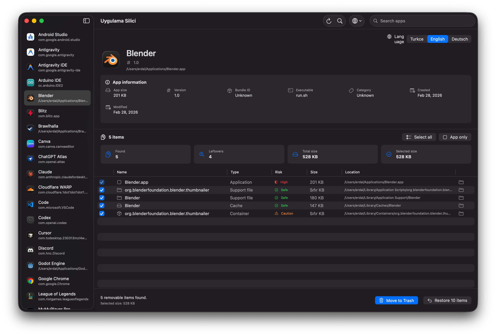

# Uygulama Silici

Uygulama Silici, macOS icin gelistirilmis sade ve kullanimi kolay bir uygulama kaldirma aracidir. Uygulamalari listeler, secilen uygulamayla iliskili olasi kalinti dosyalarini bulur ve kullanici onayiyla secili ogeleri macOS Cop Sepeti'ne tasir.

> Bu uygulama dosyalari kalici olarak silmez. Tum kaldirma islemleri once Cop Sepeti'ne tasinir.

## Ozellikler

- `/Applications` ve `~/Applications` klasorlerindeki uygulamalari listeler.
- Uygulama adina ve bundle identifier bilgisine gore arama yapar.
- Secilen uygulamanin olasi kalinti dosyalarini tarar.
- Bulunan ogeleri tablo halinde gosterir.
- Kalinti dosyalarini tek tek secme veya secimi temizleme imkani sunar.
- Uygulama ve kalinti dosyalarini kullanici onayindan sonra Cop Sepeti'ne tasir.
- Sistem ve yardimci uygulamalarda kaldirma dugmesini guvenlik nedeniyle kapatir.
- Turkce, English ve Deutsch dil destegi vardir.
- Finder'dan cift tikla acilabilen `.app` paketi uretilebilir.
- Modern macOS tarzinda ozel uygulama ikonu icerir.

## Ekran Goruntuleri

Ekran goruntulerini `docs/screenshots` klasorune ekledikten sonra GitHub bu bolumde otomatik olarak gosterir.

```markdown

```

Ornek dosya yolu:

```text
docs/screenshots/main-window.png
```

## Taranan Konumlar

Uygulama, secilen uygulamayla iliskili dosyalari kullanici kutuphanesindeki yaygin konumlarda arar:

```text
~/Library/Application Support
~/Library/Caches
~/Library/Preferences
~/Library/Logs
~/Library/Containers
~/Library/Group Containers
~/Library/Saved Application State
~/Library/HTTPStorages
~/Library/LaunchAgents
```

Yonetici izni gerektiren sistem geneli konumlar ilk surumde kasitli olarak kapsam disi tutulmustur.

## Gereksinimler

- macOS 14 veya uzeri
- Xcode 26 veya uyumlu Swift toolchain
- Swift 6

## Calistirma

Projeyi terminalden calistirmak icin:

```bash
swift run
```

Derlemek icin:

```bash
swift build
```

## Cift Tikla Acilan Uygulama Paketi Olusturma

Finder'dan cift tikla acilabilen `.app` paketi olusturmak icin:

```bash
./scripts/build_app.sh
```

Bu komut su dosyayi olusturur:

```text
dist/Uygulama Silici.app
```

Uygulama ikonu `BundleResources/AppIcon.png` dosyasindan uretilir ve paketleme sirasinda otomatik olarak `.icns` formatina donusturulur.

## Xcode ile Gelistirme

Bu klasoru Xcode'da Swift Package olarak acabilirsiniz:

1. Xcode'u acin.
2. `File > Open...` secin.
3. Proje klasorunu secin.
4. `UygulamaSilici` target'ini calistirin.

## Guvenlik Notu

Uygulama kaldirma islemlerinde temkinli davranir:

- Secili dosyalari dogrudan silmez.
- Ogeleri Cop Sepeti'ne tasir.
- Sistem uygulamalarini ve yardimci uygulamalari yanlislikla kaldirmayi engeller.
- Bulunan kalinti dosyalarini kullaniciya gosterir ve secim hakki verir.

## Gizlilik

Uygulama Silici veri toplamaz, internet baglantisi kullanmaz ve herhangi bir sunucuya bilgi gondermez. Uygulama listesi, dosya tarama sonuclari ve kaldirma gecmisi yalnizca kullanicinin Mac'i uzerinde yerel olarak islenir.

Kaldirma gecmisi, geri alma ozelligi icin su yerel dosyada tutulur:

```text
~/Library/Application Support/UygulamaSilici/removal-history.json
```

## Bilinen Sinirlamalar

- Uygulama su an Apple Developer hesabi ile imzalanmamis ve notarize edilmemistir. Bu nedenle macOS ilk acilista guvenlik uyarisi gosterebilir.
- Ilk acilista uygulamaya sag tiklayip `Open / Ac` secmek gerekebilir.
- Bazi sistem geneli dosyalari Cop Sepeti'ne tasimak icin ek izin gerekebilir.
- Uygulama dosyalari kalici olarak silmez; secili ogeleri macOS Cop Sepeti'ne tasir.
- Kalinti tarama eslesmeleri uygulama adi, bundle identifier ve yaygin destek dosyasi konumlarina gore yapilir; her uygulama icin tum kalintilari garanti etmeyebilir.

## Lisans

Bu proje MIT lisansi ile yayinlanmistir. Ayrinti icin [LICENSE](LICENSE) dosyasina bakin.
